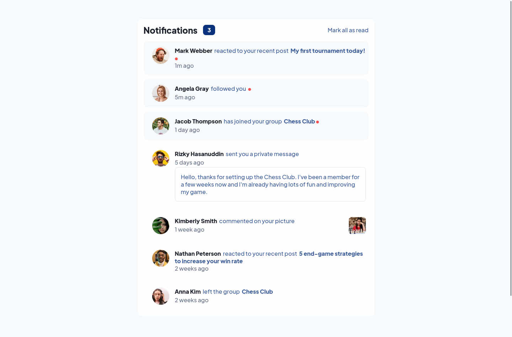

# Frontend Mentor - Notifications page solution

This is a solution to the [Notifications page challenge on Frontend Mentor](https://www.frontendmentor.io/challenges/notifications-page-DqK5QAmKbC). Frontend Mentor challenges help you improve your coding skills by building realistic projects. 

## Table of contents

- [Overview](#overview)
  - [The challenge](#the-challenge)
  - [Screenshot](#screenshot)
  - [Links](#links)
- [My process](#my-process)
  - [Built with](#built-with)
  - [What I learned](#what-i-learned)
  - [Useful resources](#useful-resources)
- [Author](#author)


## Overview

### The challenge

Users should be able to:

- Distinguish between "unread" and "read" notifications
- Select "Mark all as read" to toggle the visual state of the unread notifications and set the number of unread messages to zero
- View the optimal layout for the interface depending on their device's screen size
- See hover and focus states for all interactive elements on the page

### Screenshot




### Links

- Solution URL: [Github](https://github.com/rudimediaz/fem-notification-page)
- Live Site URL: [Live Site](https://rudhifemnotif.netlify.app/)

## My process

### Built with

- Semantic HTML5 markup
- CSS custom properties
- Flexbox
- CSS Grid
- Mobile-first workflow
- [Svelte](https://svelte.dev/) - JS library


### What I learned

To make UI react to state change.

 - Logic

 ```js
 import { derived, writable } from "svelte/store";

/**
 * @typedef {Object} UserNotification
 * @property {string} id
 * @property {string} from
 * @property {string} avatar
 * @property {string=} subject
 * @property {string} message
 * @property {boolean} isMedia
 * @property {string=} content
 * @property {boolean} read
 * @property {string} occured
 */

/** @type {Array<UserNotification>} */
const notifications = [
  {
    id: "fdb21fb099c46ede",
    from: "Mark Webber",
    avatar: "/avatar-mark-webber.webp",
    subject: "My first tournament today!",
    message: "reacted to your recent post",
    isMedia: false,
    read: false,
    occured: "1m ago",
  },
  {
    id: "94bd23cacb9db5c2",
    from: "Angela Gray",
    avatar: "/avatar-angela-gray.webp",
    message: "followed you",
    isMedia: false,
    read: false,
    occured: "5m ago",
  },
  {
    id: "0431792fb45e203f",
    from: "Jacob Thompson",
    avatar: "/avatar-jacob-thompson.webp",
    subject: "Chess Club",
    message: "has joined your group",
    isMedia: false,
    read: false,
    occured: "1 day ago",
  },
  {
    id: "344085413008fab7",
    from: "Rizky Hasanuddin",
    avatar: "/avatar-rizky-hasanuddin.webp",
    message: "sent you a private message",
    content:
      "Hello, thanks for setting up the Chess Club. I've been a member for a few weeks now and I'm already having lots of fun and improving my game.",
    isMedia: false,
    read: true,
    occured: "5 days ago",
  },
  {
    id: "aac40c685307074a",
    from: "Kimberly Smith",
    avatar: "/avatar-kimberly-smith.webp",
    message: "commented on your picture",
    subject: "/image-chess.webp",
    isMedia: true,
    read: true,
    occured: "1 week ago",
  },
  {
    id: "6be26b92146532fd",
    from: "Nathan Peterson",
    avatar: "/avatar-nathan-peterson.webp",
    subject: "5 end-game strategies to increase your win rate",
    message: "reacted to your recent post",
    isMedia: false,
    read: true,
    occured: "2 weeks ago",
  },
  {
    id: "3256cea038f383bf",
    from: "Anna Kim",
    avatar: "/avatar-anna-kim.webp",
    subject: "Chess Club",
    message: "left the group",
    isMedia: false,
    read: true,
    occured: "2 weeks ago",
  },
];

export function useNotificationStore() {
  const _items = writable(notifications);
  const unread = derived(_items, (val) => {
    return val.filter((v) => v.read === false).length;
  });
  const items = derived(_items, (v) => v);
  /**
   *
   * @param {string} id
   *
   */
  function setRead(id, read = true) {
    _items.update((items) => {
      return items.reduce((a, c) => {
        if (c.id === id) {
          const updated = { ...c, read };
          return [...a, updated];
        }

        return [...a, c];
      }, []);
    });
  }

  function setAllRead() {
    _items.update((its) => {
      return its.map((it) => ({ ...it, read: true }));
    });
  }

  return /**@type {const} */ ({ setRead, unread, items, setAllRead });
}

 ```

 - Markup
```html
<script>
import NotificationCard from "./NotificationCard.svelte";
import { useNotificationStore } from "./notifications";

const {
  unread,
  setAllRead,
  setRead,
  items: notificationItems,
} = useNotificationStore();

$: isAnyUnread = $unread > 0;

/**
 * @param {MouseEvent} ev
 */
function handleAllRead(ev) {
  ev.preventDefault();
  setAllRead();
}

/**
 *
 * @param {CustomEvent<{id : string}>} ev
 */
function handleCardClick(ev) {
  setRead(ev.detail.id);
}
</script>

<div class={`${$$props.class} root`}>
  <div class="heading">
    <span class="title">Notifications</span>
    <div class="badge" data-is-any-unread={isAnyUnread}>
      {$unread}
    </div>
    <a href="#!" class="action" on:click={handleAllRead}
      >Mark all as read</a
    >
  </div>
  <div class="body">
    {#each $notificationItems as notificationItem}
      <NotificationCard
        id={notificationItem.id}
        avatar={notificationItem.avatar}
        message={notificationItem.message}
        subject={notificationItem.subject}
        isMedia={notificationItem.isMedia}
        occured={notificationItem.occured}
        notificationFrom={notificationItem.from}
        content={notificationItem.content}
        isRead={notificationItem.read}
        on:subjectclick={handleCardClick}
      />
    {/each}
  </div>
</div>

<style>
.root {
  color: var(--clr-n-5);
  background-color: #fff;
  padding-inline: 1rem;
  display: flex;
  flex-direction: column;
  gap: 1rem;
  padding-block: 1rem;
  border-radius: 0.75rem;
  box-shadow: 0px 2px 5px 1px hsl(var(--clr-n-5) / 0.7),
    0px 4px 8px 2px hsl(var(--clr-n-5) / 0.6),
    0px 8px 10px 4px hsl(var(--clr-n-5) / 0.5);
}

@media (max-width: 25em) {
  .root {
    font-size: clamp(0.875rem, 0.5rem + 0.42vw, 1rem);
  }
}

.heading {
  display: flex;
  align-items: center;
}

.title,
.badge {
  font-weight: 800;
}

.title {
  color: var(--clr-n-6);
  font-size: 1.5rem;
}
@media (max-width: 25em) {
  .title {
    font-size: clamp(1.25rem, 1.25rem + 0.8333333333333334vw, 1.5rem);
  }
}
.badge {
  background-color: var(--clr-blue);
  color: #fff;
  padding: 0.25rem 0.75em;
  border-radius: 0.5rem;
  margin-inline-start: 1rem;
  margin-inline-end: auto;
}

.badge[data-is-any-unread="false"] {
  visibility: collapse;
}

.action,
.action:visited {
  color: inherit;
}

.action {
  text-decoration: none;
}

@media (hover: hover) {
  .action:hover {
    color: var(--clr-blue);
  }
}

.body {
  display: flex;
  flex-direction: column;
  gap: 0.75rem;
}
</style>

```

You can look more in the source code (not too much file).

### Useful resources

- [Svelte Interactive Tutorial](https://svelte.dev/tutorial) - This is about getting started with svelte


## Author


- Frontend Mentor - [@rudimediaz](https://www.frontendmentor.io/profile/rudimediaz)
- Twitter - [@rudimediaz](https://www.twitter.com/rudimediaz)


